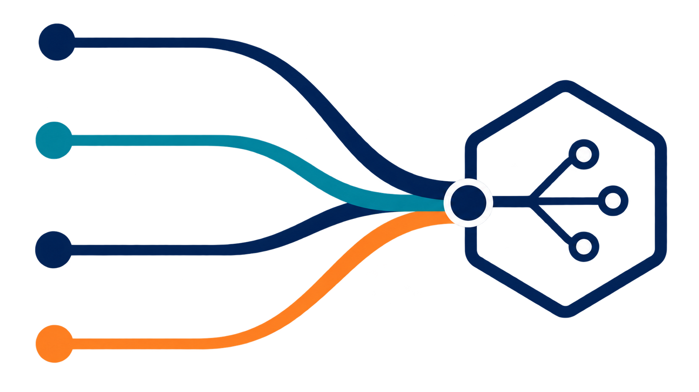

<div align="center">

# 🌐 SANGAM
### Standardized AI-driven National Gateway for Aggregated Materials
**Smart India Hackathon (SIH) 2026 · Problem Statement ID: 26099**

*Empowering "One Nation – One Material Code" across Central Public Sector Enterprises (CPSEs)*

---



</div>

## 📌 Executive Summary

Central Public Sector Enterprises (CPSEs) in sectors such as Oil & Gas, Power, Steel, Mining, and Heavy Engineering (e.g., CPCL, IOCL, SAIL, BHEL, ONGC) procure and maintain millions of functionally equivalent materials. However, disparate legacy ERP systems use differing material codes, descriptions, and measurement units, resulting in:
- **Massive duplication** in material masters across enterprises.
- **Fragmented procurement data** leading to lost bulk-purchasing bargaining power.
- **High inventory holding costs** and redundant spares stored across plants.
- **Supply chain delays** when equivalent materials exist in neighboring CPSEs but cannot be identified.

**SANGAM** is an enterprise-grade AI-powered platform designed to eliminate these inefficiencies by providing:
1. **Automated Multi-Signal Deduplication**: Hybrid semantic vectors (384-D), fuzzy string alignment, attribute tokenization, and domain-specific engineering rules.
2. **Common National Material Code (NMC) Generation**: Deterministic, collision-safe hierarchical taxonomy (`NMC-CATEGORY-PRODUCT-MATERIAL-SIZE-SEQ`).
3. **Automated Legacy Code Harmonization**: Seamless cross-mapping of CPSE codes to NMCs with human-in-the-loop review.
4. **Immutable Audit Trail & Governance**: Complete forensic ledger of all validations, approvals, and taxonomy changes.
5. **Real-Time Live AI Terminal**: Transparent telemetry of the matching engine, embeddings, and scoring decisions.
6. **SAP / ERP Integration Capabilities**: RESTful ERP lookup adapter and batch mapping export endpoints.

---

## 🏗️ System Architecture

```text
       ┌─────────────────────────────────────────────────────────┐
       │                Modern Enterprise Frontend               │
       │      React 19 + TypeScript + Vite + Recharts + Lucide   │
       └────────────────────────────┬────────────────────────────┘
                                    │ REST API / JWT Bearer
                                    ▼
       ┌─────────────────────────────────────────────────────────┐
       │                FastAPI Application Backend              │
       │   - AI Harmonization Pipeline    - Batch Detection API  │
       │   - Immutable Audit Logger       - SAP/ERP Adapter      │
       │   - Live System Trace Telemetry  - NMC Code Generator   │
       └──────────────┬───────────────────────────┬──────────────┘
                      │                           │
                      ▼                           ▼
       ┌──────────────────────────────┐  ┌────────────────────────┐
       │     Hybrid AI Engine (CPU)   │  │ Supabase PostgreSQL DB │
       │ - Sentence-Transformers      │  │ - pgvector Vector Store│
       │ - RapidFuzz + Jaccard        │  │ - Relational Masters   │
       │ - Critical Rule Constraints  │  │ - Immutable Audit Logs │
       └──────────────────────────────┘  └────────────────────────┘
```

---

## 🎯 Key SIH 2026 Capabilities Implemented

| # | SIH Capability | Implementation in SANGAM | Status |
|---|---|---|:---:|
| **1** | **AI Material Matching** | 4-signal hybrid scoring (`Semantic (35%)` + `Fuzzy (20%)` + `Attribute (25%)` + `Technical Specs (20%)`). Enforces strict critical attribute vetoes (e.g. 2" valve ≠ 4" valve). |  **Production-Ready** |
| **2** | **Duplicate & Cluster Detection** | Individual row matching & batch duplicate detection across the entire master (`POST /api/v1/matches/batch-detect`). |  **Production-Ready** |
| **3** | **National Material Code Generation** | Automatic generation of deterministic, human-readable National Codes (`NMC-CATEGORY-...`) upon match approval via `national_code_service.py`. |  **Production-Ready** |
| **4** | **CPSE Legacy Code Mapping** | Automatic bi-directional link creation (`MaterialMapping`) connecting enterprise legacy codes to verified NMCs. |  **Production-Ready** |
| **5** | **Automated Classification** | Intelligent rule-based classifier (`classification_service.py`) that auto-assigns 8+ industrial categories (Valves, Pipes, Pumps, Motors, Bearings, Fasteners, Gaskets, Instruments). |  **Production-Ready** |
| **6** | **Audit Trail & Governance** | Immutable `AuditLog` ledger tracking every match review, approval, upload, and code generation with user IDs and timestamps. |  **Production-Ready** |
| **7** | **Live AI Engine Terminal** | Real-time console (`/terminal` and floating quick-dock) streaming internal kernel decisions, vector embeddings, and rule executions. |  **Production-Ready** |
| **8** | **SAP / ERP Integration** | Mock ERP adapter (`POST /api/v1/integration/lookup` and `/export-mappings`) enabling real-time material lookup and mapping synchronization. |  **Production-Ready** |

---

## 🚀 Getting Started

### Prerequisites
- **Python 3.12+**
- **Node.js 20+** & `npm`
- **Supabase Account** (PostgreSQL with `pgvector` enabled)

---

### Step 1: Environment Configuration

Copy the template environment file in the root directory:

```powershell
# Windows PowerShell:
Copy-Item .env_example .env

# Linux / macOS:
cp .env_example .env
```

Also copy to the backend directory:

```powershell
Copy-Item .env_example backend\.env
```

Configure your `.env` with your Supabase credentials:

```env
SUPABASE_PROJECT_ID=your_project_id
SUPABASE_URL=https://your_project_id.supabase.co
SUPABASE_ANON_KEY=your_supabase_anon_key
SUPABASE_SERVICE_ROLE_KEY=your_service_role_key

# PostgreSQL Connection String (Session pooler on port 5432)
DATABASE_URL=postgresql+asyncpg://postgres.[PROJECT_REF]:[PASSWORD]@[HOST]:5432/postgres
DATABASE_URL_SYNC=postgresql+psycopg://postgres.[PROJECT_REF]:[PASSWORD]@[HOST]:5432/postgres

JWT_SECRET_KEY=generate_a_long_random_jwt_secret
SECRET_KEY=generate_a_long_random_general_secret
ACCESS_TOKEN_EXPIRE_MINUTES=60

CORS_ORIGINS=http://localhost:5173,http://localhost:5174

VECTOR_BACKEND=pgvector
```

---

### Step 2: Backend Setup & Run

Open a terminal in the `backend` folder:

```powershell
cd backend

# 1. Install CPU-optimized PyTorch and dependencies
pip install -r requirements-cpu.txt
pip install -e ".[dev]"

# 2. Run Database Migrations
$env:PYTHONPATH="."
alembic upgrade head

# 3. Seed Demo CPSEs and Materials
python -m app.db.seed

# 4. Start the FastAPI Server
uvicorn app.main:app --reload --port 8000
```

* **Swagger API Docs**: `http://localhost:8000/docs`
* **Health Check**: `http://localhost:8000/health`

---

### Step 3: Frontend Setup & Run

Open a terminal in the `frontend` folder:

```powershell
cd frontend

# Install Node dependencies
npm install

# Start Vite Development Server
npm run dev
```

* **Application URL**: `http://localhost:5173`

---

## 🔑 Demo Credentials

| Role | Email | Password | Access Scope |
|---|---|---|---|
| **Administrator** | `admin@sangam.gov.in` | `admin_secure_password_2026` | Full platform, user management, audit logs |
| **Technical Reviewer** | `reviewer@bmim.gov.in` | `Reviewer@123` | Match approval, rejection, and NMC creation |
| **CPSE Manager (CPCL)**| `manager@bmim.gov.in` | `Manager@123` | CSV ingestion and CPSE-specific catalog view |

---

## 🧪 Testing & Verification

Run the automated test suite covering deterministic NMC code generation, valve abbreviation normalization, critical attribute safety checks, and neutral score bias prevention:

```powershell
cd backend
python -m pytest tests/ -v
```

---

## 🛡️ Matching Safety & Explainability

* **Explainable AI (XAI)**: Every match recommendation stores a JSON breakdown showing the individual scores:
  * `semantic_score`: Dense vector cosine similarity via `all-MiniLM-L6-v2`.
  * `fuzzy_score`: Token sort ratio handling typos and word re-orderings.
  * `attribute_score`: Jaccard similarity across extracted key-value pairs.
  * `technical_score`: Rule-based verification of sizes, pressure classes, and material grades.
* **Hard Rule Vetoes**: Contradictory critical attributes (e.g. `DN50` vs `DN100`, or `SS316` vs `CS Carbon Steel`) strictly cap the maximum confidence score below duplicate thresholds, preventing false positives.

---

## 📄 License & Attribution

Developed for **Smart India Hackathon 2026** (Problem Statement 26099: *AI-Driven Standardization and Harmonization of Material Codes Across CPSEs*).
