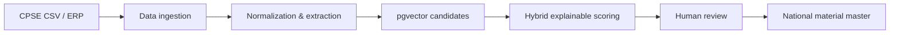

# Architecture

BMIM is a Docker Compose monorepo. React/Vite provides the enterprise UI; FastAPI exposes versioned REST endpoints; PostgreSQL with pgvector stores operational data and embeddings. CSV descriptions are normalized and attribute-extracted at ingestion. Human reviewers retain control over mappings.

