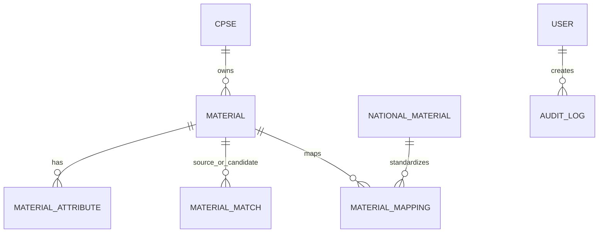

# Database

Core entities are `cpses`, `users`, `material_categories`, `materials`, `material_attributes`, `material_embeddings`, `material_matches`, `national_materials`, `material_mappings`, `upload_jobs`, and `audit_logs`. Alembic migration `001_initial_schema` creates constraints and the pgvector IVFFlat index.

